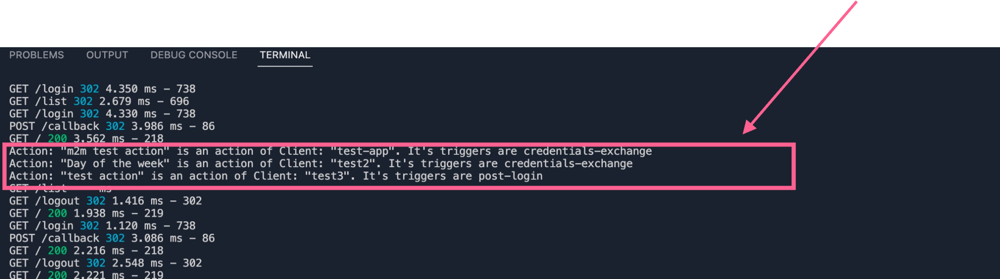

##  👓 About this Project
A Node server that will make a call to an Auth0 tenant's Management API, using an authorized client's credentials. 

When trying to access on the /list route in the index file, you will be redirected to your API's login page. Authenticating into your application will then allow you to access the /list route.

Upon successfully authenticating, the endpoint will recieve a bearer token, which the server can then use to fetch all deployed clients and actions from the tenant.

This script assumes (and only handles) the code blocks of the user's actions that make reference to a client(s) via the `client_id`. It will use the client's ID as a substring to search for, within the action's code block (string).

Afterwards, it will console.log a dymanic list of tenant's actions, the client they reference, and their supported triggers.



## 🚨 Forking this repo (please read!)

You will need your own _**CLIENT_ID**_, _**CLIENT_SECRET**_, _**DOMAIN**_, _**SECRET**_, _**BASEURL**_, and _**AUTH0_ISSUER_BASE_URL**_
Make sure that the application credentials are authorised to use your Management API.

The API must also have the `read:clients` and `read:actions` scopes enabled.


## 🛠 Installation & Set Up

1. Install and use the correct version of NPM

   ```sh
   npm install npm@latest -g
   ```

2. Install dependencies

   ```sh
   npm install
   ```

3. Start the development server

   ```sh
   npm start